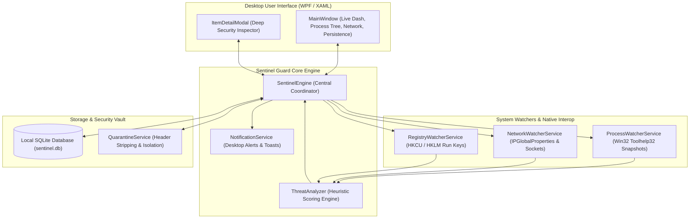

# 🛡️ Sentinel Guard — Enterprise Windows Endpoint Security & Telemetry Engine

[](https://microsoft.com/windows)
[](https://dotnet.microsoft.com/download/dotnet/8.0)
[](https://sqlite.org)
[](LICENSE)

**Sentinel Guard** is a lightweight, real-time endpoint threat detection and forensics agent built in **C# (.NET 8) with WPF**. Engineered for security analysts, system administrators, and developers, it tracks live process hierarchies, unmasks rogue parent-child chains, audits active network sockets, inspects startup persistence, and provides an isolated quarantine vault.

---

## 🌟 Key Features

- 🕵️ **Live Threat Detection & Masquerading Shield**: Automatically identifies malicious masquerading binaries (such as rogue `svchost.exe` or `lsass.exe` outside `System32`), suspicious LOLBins (`certutil`, `bitsadmin`, `powershell -enc`), and abnormal execution paths.
- 🌳 **True Parent-Child Process Hierarchy**: Uses native Win32 `Toolhelp32` kernel snapshots to reconstruct parent PIDs and determine exactly which automation runner, terminal, or background agent spawned a process.
- 🌐 **Real-Time Network Socket Forensics**: Monitors active TCP/UDP connections, listening ports, remote IPs, and network states associated with running executables.
- 🔑 **Registry & Startup Persistence Guard**: Continuously inspects Windows Run keys, startup folders, and persistence mechanisms to detect stealthy auto-launch items.
- 🔍 **Interactive Deep Security Inspector**: Click on any alert badge (`INFO`, `SAFE`, `HIGH`, `CRITICAL`) to inspect full binary paths, digital certificate vendor signatures (DigiCert, Microsoft), command-line arguments, and heuristic detection details.
- ⚡ **Universal Bulk Actions**: Multi-select processes across tabs to execute batch operations: *Bulk Mark Safe*, *Bulk Trust Parents*, *Bulk Terminate*, and *Bulk Remove*.
- 🔒 **Isolated Quarantine Vault**: Neutralizes threats by stripping executable headers and safely isolating malicious binaries away from the filesystem.
- 🛡️ **Offline Privacy & Zero Telemetry**: 100% local embedded SQLite database with parameterized queries. No external cloud calls, no telemetry, and no open listening ports.

---

## 🏗️ Architecture



---

## 📁 Repository Structure

```text
sentinel-guard/
├── Models/
│   └── Models.cs               # ProcessEvent, NetworkItem, ThreatRule, and UI ViewModels
├── Services/
│   ├── SentinelEngine.cs        # Primary orchestrator coordinating watchers and analyzer
│   ├── ProcessWatcherService.cs # Real-time process creation and lifecycle tracker
│   ├── ProcessInfoHelper.cs     # Win32 Toolhelp32 process tree and signature resolver
│   ├── NetworkWatcherService.cs # TCP/UDP socket telemetry and port watcher
│   ├── RegistryWatcherService.cs# Windows startup and autorun persistence monitor
│   ├── ThreatAnalyzer.cs       # Heuristic risk evaluation and detection rules
│   ├── DatabaseService.cs      # SQLite database schema, CRUD, and audit logging
│   ├── QuarantineService.cs    # File quarantine, header stripping, and vault restoration
│   └── NotificationService.cs  # System tray notifications and UI alerts
├── App.xaml / App.xaml.cs      # Application entry point and theme resources
├── MainWindow.xaml / .cs       # Main dark-themed security dashboard
├── ItemDetailModal.xaml / .cs  # Detailed threat inspection modal dialog
├── AssemblyInfo.cs             # Assembly metadata and manifest configuration
├── SentinelGuard.csproj        # .NET 8 WPF project file
├── installer.iss               # Inno Setup compiler script for building Windows installer
├── build.bat                   # 1-click Windows release build and publish script
├── .github/
│   └── workflows/
│       └── build.yml           # Automated CI/CD workflow building and publishing releases
├── .gitignore                  # Git ignore rules for .NET / Visual Studio
├── .gitattributes              # Cross-platform CRLF/LF line normalization
├── LICENSE                     # MIT License
└── README.md                   # Full project documentation
```

---

## 🛠️ Prerequisites

- **OS:** Windows 10 (Build 19041+) or Windows 11 (x64)
- **Runtime / SDK:** [.NET 8.0 SDK](https://dotnet.microsoft.com/download/dotnet/8.0) or higher
- **Inno Setup 6** (optional, for compiling Windows `Setup.exe` installers)

---

## 🚀 Building & Publishing from Source

### Quick Build (Command Line)

Run the included build script:
```cmd
build.bat
```

Or manually using the .NET CLI:

```powershell
# 1. Restore NuGet dependencies
dotnet restore SentinelGuard.csproj

# 2. Build in Release configuration
dotnet build SentinelGuard.csproj -c Release

# 3. Publish self-contained single-file binary
dotnet publish SentinelGuard.csproj -c Release -r win-x64 --self-contained true -p:PublishSingleFile=true -o publish
```

The compiled single-file binary will be generated at:
`publish/SentinelGuard.exe`

---

## 📦 Compiling Windows Installer (Inno Setup)

Once the application is published to `publish/`, you can compile an installer using [Inno Setup](https://jrsoftware.org/isdl.php):

1. Open `installer.iss` in Inno Setup Compiler.
2. Click **Build > Compile** (or run `iscc installer.iss` from command line).
3. The setup package will be generated at:
   `dist_installer/SentinelGuard_Setup.exe`

---

## 🤖 Continuous Integration & Releases

This repository includes a GitHub Actions workflow (`.github/workflows/build.yml`) that runs on `windows-latest`:
* Automatically restores, compiles, and verifies builds on pull requests.
* Produces ready-to-run release packages when git tags are pushed:
  ```bash
  git tag v3.0.0
  git push origin v3.0.0
  ```

---

## 📄 License

This project is licensed under the [MIT License](LICENSE) — see the LICENSE file for details.
